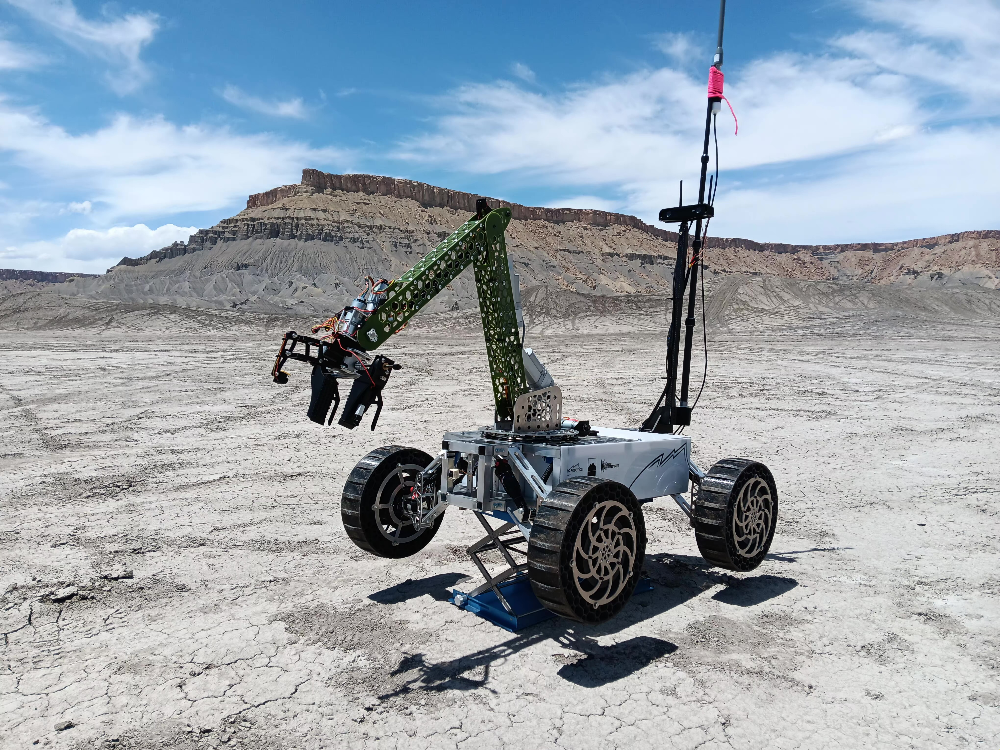

# Arm_2022_23

### Summary
* This repo contains code for control of the robotic arm on the Saddleback College Robotics Club's rover "Helios".
* The repo consists of backend code to interface with the motor controllers, and also control code that interfaces with a gamepad controller.
* The program has three methods of control: Closed loop, Simulation, Open loop.
* Closed loop is used for the manual control of the arm. In this case being controlled via a standard PS5 gamepad controller.
* Simulation consists of a digital twin of the arm. This being an inverse kinematic model developed in Unity Engine. Given this contol mode, the real robotic arm will attempt to move to the position of the arm in the simulation.
* Open loop mode is just for educational purposes, regarding the idea of a closed loop system.

### Real arm and simulated arm

